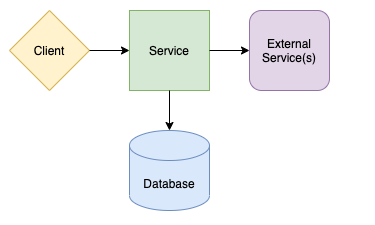
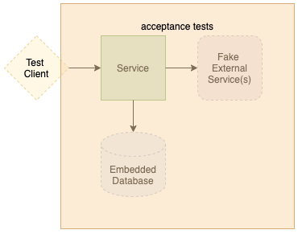

# Testing Guide

The Todos application includes a comprehensive testing strategy covering all aspects from unit tests to performance benchmarks. Our testing pyramid ensures high code quality and confidence in deployments.

## Testing Strategy



The application follows a multi-layered testing approach:

1. **Unit Tests** - Fast, isolated tests for business logic
2. **Integration Tests** - Component interaction testing
3. **Acceptance Tests** - End-to-end behavior validation
4. **Performance Tests** - Load testing and performance validation

## Running Tests

### Quick Test Commands

```bash
# Run all unit tests
./mvnw test

# Run all tests including integration
./mvnw verify

# Run specific module tests
./mvnw test -pl domain
./mvnw test -pl application

# Run with coverage report
./mvnw clean verify jacoco:report
```

### Performance Testing

```bash
# Run Gatling performance tests
./mvnw -pl performance-benchmark verify

# Run performance tests standalone
./mvnw -pl performance-benchmark gatling:test
```

## Unit Testing


**Coverage**: 100% line coverage with mutation testing

**Technologies**:
- JUnit 5 for test framework
- Mockito for mocking dependencies
- AssertJ for fluent assertions
- EqualsVerifier for equals/hashCode contracts

**Test Structure**:
```
domain/src/test/java/
├── ChecklistTest.java         # Domain entity tests
├── ChecklistIdTest.java       # Value object tests
├── ChecklistNameTest.java     # Value object tests
└── TodoTest.java             # Domain logic tests
```

**Example Unit Test**:
```java
@Test
void shouldCreateChecklistWithName() {
    // Given
    ChecklistName name = ChecklistName.newChecklistName("Shopping List");

    // When
    Checklist checklist = Checklist.namedEmptyChecklist(name.getValue());

    // Then
    assertThat(checklist.getName()).isEqualTo(name);
    assertThat(checklist.getTodos()).isEmpty();
}
```

**Quality Gates**:
- 100% line coverage required
- 100% mutation score with PIT testing
- All equals/hashCode contracts verified

## Integration Testing


**Coverage**: Full API endpoint coverage with WebFlux testing

**Technologies**:
- Spring Boot Test with WebFlux
- TestContainers for database integration
- WebTestClient for reactive web testing
- HAL+JSON assertion helpers

**Test Structure**:
```
application/src/test/java/
├── ChecklistsResourceIT.java  # Checklists API tests
├── ChecklistResourceIT.java   # Individual checklist API tests
├── TasksResourceIT.java       # Tasks API tests
└── RootResourceIT.java        # Root API discovery tests
```

**Example Integration Test**:
```java
@WebFluxTest(controllers = ChecklistsResource.class)
class ChecklistsResourceIT {

    @Autowired
    private WebTestClient webTestClient;

    @MockBean
    private CreateChecklistUseCase createChecklistUseCase;

    @Test
    void shouldCreateChecklist() {
        // Given
        when(createChecklistUseCase.createChecklist(any()))
            .thenReturn(Mono.just(namedEmptyChecklist("Shopping List")));

        // When & Then
        webTestClient
            .post()
            .uri("/checklists")
            .contentType(APPLICATION_JSON)
            .accept(HAL_JSON)
            .bodyValue("{\"name\": \"Shopping List\"}")
            .exchange()
            .expectStatus().isCreated()
            .expectHeader().exists("Location")
            .expectBody()
            .jsonPath("$.name").isEqualTo("Shopping List")
            .jsonPath("$._links.self.href").exists();
    }
}
```

## Acceptance Testing



**Coverage**: Complete user journey validation

**Technologies**:
- Cucumber for BDD scenarios
- Spring Boot integration testing
- Docker Compose for full stack testing
- REST Assured for API testing

**Test Structure**:
```
acceptance-tests/src/test/
├── resources/features/        # Cucumber feature files
├── java/steps/               # Step definitions
└── java/support/            # Test configuration
```

**Example Feature**:
```gherkin
Feature: Checklist Management
  As a user
  I want to manage checklists
  So that I can organize my todos

  Scenario: Creating a new checklist
    Given the API is available
    When I create a checklist named "Weekend Tasks"
    Then the checklist should be created successfully
    And the response should include a self link
    And the checklist should be retrievable by ID
```

**Running Acceptance Tests**:
```bash
# Start the application stack
docker-compose -f config/docker-compose.yml up -d

# Run acceptance tests
./mvnw -pl acceptance-tests verify

# View cucumber reports
open acceptance-tests/target/cucumber-reports/index.html
```

## Performance Testing


**Load Testing with Gatling (Java SDK)**

**Performance Goals**:
- Response time: 95th percentile < 250ms
- Response time: 99th percentile < 900ms
- Success rate: 100%
- Throughput: 30+ requests/second

**Test Structure**:
```
performance-benchmark/src/test/java/
├── BenchmarkSimulation.java      # Main performance test
├── RootResourceAction.java       # API discovery actions
├── ChecklistsResourceAction.java # Checklist creation actions
├── ChecklistResourceAction.java  # Checklist retrieval actions
└── HealthCheckAction.java        # Health check actions
```

**Current Performance Results**:
- **5,487 total requests** processed
- **Mean response time**: 2ms
- **95th percentile**: 5ms
- **99th percentile**: 8ms
- **Success rate**: 100%
- **Throughput**: 91.45 requests/second

**Running Performance Tests**:
```bash
# Run full performance suite
./mvnw -pl performance-benchmark verify

# Run specific performance test
./mvnw -pl performance-benchmark gatling:test \
  -Dgatling.simulationClass=BenchmarkSimulation

# View performance report
open performance-benchmark/target/gatling/*/index.html
```

**Performance Test Scenarios**:
1. **Health Check Journey**: Continuous health monitoring (1 RPS)
2. **Core API Journey**: Full checklist lifecycle (30 RPS)
   - Discover API endpoints
   - Create new checklist
   - Retrieve created checklist

## Code Quality Metrics

**Static Analysis Tools**:
- **Checkstyle**: Code formatting and style consistency
- **SpotBugs**: Static analysis for common bugs and issues
- **PMD**: Code quality rules and best practices
- **ErrorProne**: Google's bug pattern detector

**Coverage & Testing Quality**:
- **JaCoCo**: Line and branch coverage measurement
- **PIT**: Mutation testing for test quality assessment

**Security Scanning**:
- **OWASP Dependency Check**: Known vulnerability scanning
- **Dependency validation**: Automated dependency updates

## Continuous Integration

**GitHub Actions Pipeline**:
```yaml
- Build: ./mvnw clean compile
- Unit Tests: ./mvnw test
- Integration Tests: ./mvnw verify
- Performance Tests: ./mvnw -pl performance-benchmark verify
- Quality Gates: All quality checks must pass
- Security Scan: OWASP dependency check
- Docker Build: Native image compilation
```

**Quality Gates**:
- All tests must pass (0 failures)
- Code coverage ≥ 80%
- No critical security vulnerabilities
- Performance benchmarks within SLA
- All static analysis checks pass

## Test Data Management

**Test Isolation**:
- Each test uses unique identifiers (UUID)
- Database state isolated per test
- No shared state between tests
- Clean setup/teardown procedures

**Mock Strategy**:
- Repository layer mocked for unit tests
- Real database for integration tests
- TestContainers for isolated database testing
- External service mocks for acceptance tests

## Best Practices

1. **Fast Feedback**: Unit tests run in milliseconds
2. **Test Pyramid**: More unit tests, fewer integration tests
3. **BDD Scenarios**: Business-readable acceptance criteria
4. **Performance Baseline**: Automated performance regression detection
5. **Test Documentation**: Self-documenting test names and scenarios

For more details on specific testing approaches, see individual test modules in the codebase.